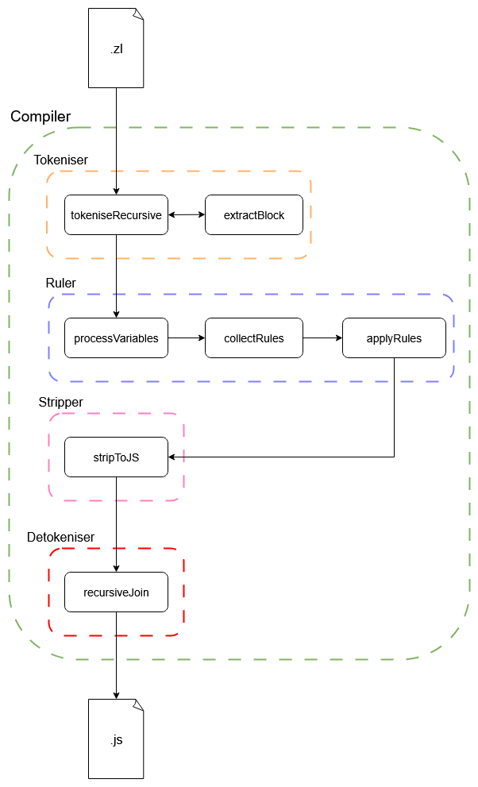

# Zach lang

Custom .zl language compiler, zl uses tags instead of types to enforce paramter safety.

<figure style='width: 400px'>
  
  <figcaption style='text-align: center'>Fig.1 - Diagram of how .zl files are compiled to .js</figcaption>
</figure>

## What is zl

zl files are very similiar to javascript, however, you can also add tags. When you add a tag to function it'll mean all paramaters that are passed in must also have the tag given to them at initialisation. It also means all parameters of the function must be variables.

## How to use

Create your .zl files (essentially text files).

Compile with: `node compiler.js path/to/your/directory`

This will output plain js in /dist.

If you setup a html file it'll have to point to this dist.
